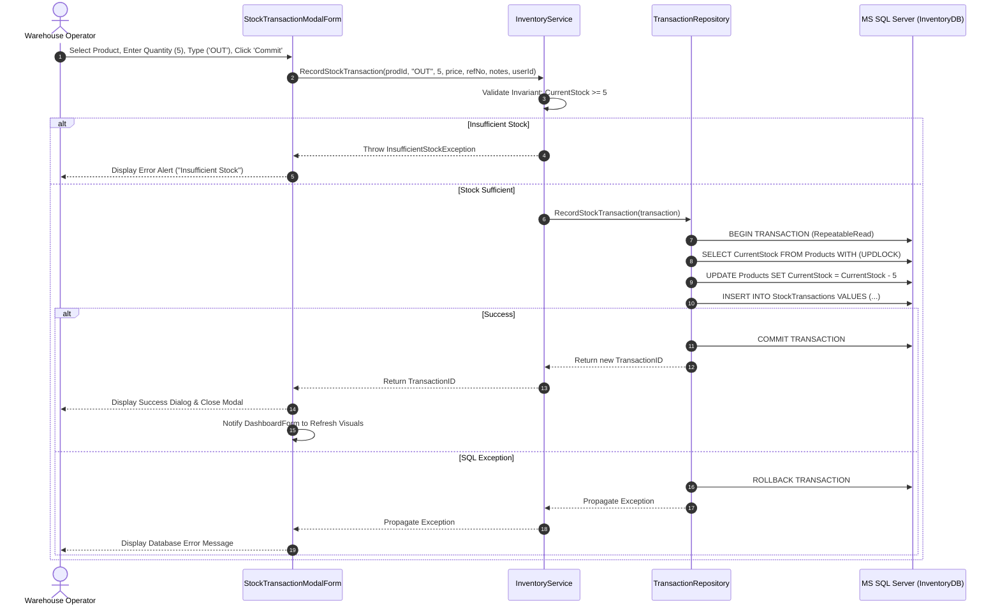

# ACADEMIC & ENTERPRISE SYSTEM REPORT
## Title: Inventory Management System: Enterprise 3-Tier Architecture & Object-Oriented Analysis and Design
**Course:** Object-Oriented Analysis and Design (OOAD)  
**Deliverable File:** `book.docx` Reference Specification  
**Architecture:** Strict 3-Tier Architecture (Presentation, Business Logic, Data Access)  
**Technology Stack:** C# 13.0, .NET 9.0 Windows Forms, Microsoft SQL Server 2019+, ADO.NET  

---

## TABLE OF CONTENTS
1. **Chapter 1: Introduction & Project Overview**
   - 1.1 Executive Summary
   - 1.2 Problem Statement & Industry Context
   - 1.3 Project Vision & Objectives
   - 1.4 Project Scope & Delimitations
2. **Chapter 2: System Analysis**
   - 2.1 Domain Modeling & Stakeholder Identification
   - 2.2 System Actors & Role-Based Permissions
   - 2.3 Functional Requirements (FRs)
   - 2.4 Non-Functional Requirements (NFRs)
   - 2.5 Detailed Use Case Specifications
     - UC-01: Authenticate User
     - UC-02: Record Stock Influx (Stock In)
     - UC-03: Process Stock Dispatch (Stock Out)
     - UC-04: Execute Inventory Valuation Audit
     - UC-05: Monitor Low Stock Telemetry
3. **Chapter 3: System Design & OOAD Principles**
   - 3.1 Architectural Decomposition: 3-Tier Architecture
   - 3.2 Object-Oriented Principles Applied
     - 3.2.1 Encapsulation & Entity Invariants
     - 3.2.2 Abstraction & Dependency Inversion (IoC)
     - 3.2.3 Single Responsibility Principle (SRP)
     - 3.2.4 Domain-Driven Exception Hierarchy
   - 3.3 Class Diagram Specification
   - 3.4 Interaction & Sequence Diagrams
     - SD-01: Stock Inflow Process Flow
     - SD-02: Stock Outflow Concurrency & Validation Flow
   - 3.5 Database Design & Physical Data Model (ERD)
     - 3.5.1 Entity Relationship Diagram Layout
     - 3.5.2 Relational Data Dictionary
     - 3.5.3 Indexing & Performance Strategies
4. **Chapter 4: UI/UX Design & Implementation**
   - 4.1 Design Philosophy & Modern Color Palette
   - 4.2 Dashboard Layout & Information Architecture
   - 4.3 Data Visualization Integration (LiveCharts)
   - 4.4 Defensive UI Error Handling & User Guidance
5. **Chapter 5: Testing, Evaluation & Conclusion**
   - 5.1 Verification Matrix & Domain Invariant Test Cases
   - 5.2 Concurrency & Transactional Integrity Evaluation
   - 5.3 Limitations & Future Roadmap
   - 5.4 Conclusion

---

# CHAPTER 1: INTRODUCTION & PROJECT OVERVIEW

### 1.1 Executive Summary
In modern wholesale, retail, and supply chain operations, inventory represents both a company's greatest physical asset and its largest potential point of operational failure. Overstocking incurs prohibitive holding costs and capital lock-up, while stockouts result in lost revenue, broken contractual commitments, and brand erosion.

The **Inventory Management System (IMS)** is an enterprise-grade desktop solution designed and implemented in strict compliance with Object-Oriented Analysis and Design (OOAD) methodologies. The application leverages a strict **3-Tier Architecture** implemented in C# (.NET 9) with Windows Forms, backed by Microsoft SQL Server. The core design emphasizes high cohesion, loose coupling, deterministic transactional boundaries, domain-driven exception handling, and executive dashboard analytics.

### 1.2 Problem Statement & Industry Context
Traditional small-to-medium enterprise (SME) inventory workflows suffer from three pervasive vulnerabilities:
1. **Spreadsheet Fragmentation & Concurrency Collisions:** Multiple operators updating disconnected spreadsheets produce phantom inventory counts and race conditions.
2. **Deficit Overselling:** Lack of pre-dispatch inventory invariant checks allows orders to be confirmed for items that are depleted, resulting in unfulfillable commitments.
3. **Delayed Reorder Visibility:** Purchasing managers discover stock depletion only after an order fails, rather than receiving proactive low-stock warnings based on minimum reorder levels.

### 1.3 Project Vision & Objectives
The system aims to provide:
- **Zero-Deficit Enforcement:** Immediate, transactional rejection of stock withdrawals exceeding on-hand quantities.
- **Atomic Stock Logging:** Dual-operation ACID guarantees ensuring that stock balance adjustments and transaction audit trails never desynchronize.
- **Proactive Restock Telemetry:** Automated computation of stock statuses ('Optimal', 'Low Stock', 'Out of Stock') reflected instantly in visual KPI cards and data grids.
- **Executive Visual Analytics:** Visual trend tracking of monthly stock turnover and category capital allocation.

### 1.4 Project Scope & Delimitations
- **In Scope:**
  - Multi-tier catalog management (Products, Categories, Suppliers).
  - Atomic stock movement engine (IN, OUT, ADJUSTMENT).
  - Dynamic KPI generation (Total Units, Valuation, Low-Stock Count, Today's Net Movement).
  - Modern WinForms Presentation Layer utilizing LiveCharts telemetry.
- **Delimitations:**
  - Designed for intranet/local desktop deployment rather than public SaaS.
  - Barcode scanner integration is implemented via keyboard emulation string capture.

---

# CHAPTER 2: SYSTEM ANALYSIS

### 2.1 Domain Modeling & Stakeholder Identification
The core domain comprises physical items tracked through SKU codes, categorized hierarchically, supplied by verified vendors, and modified through immutable transaction events.

```
+---------------+        1..*        +---------------+
|   Supplier    |------------------->|    Product    |
+---------------+                    +---------------+
                                            | 1
+---------------+        1..*               |
|   Category    |---------------------------+
+---------------+                           |
                                            | 1..*
                                     +---------------+
                                     |StockTransaction|
                                     +---------------+
                                            | 1..*
                                            |
                                     +---------------+
                                     |     User      |
                                     +---------------+
```

### 2.2 System Actors & Role-Based Permissions
| Actor | Description | Privileges |
|---|---|---|
| **System Administrator** | High-level managerial operator | Full CRUD on products, catalog setup, user management, and financial valuation views. |
| **Warehouse Staff** | Operational inventory handler | Executes Stock In, Stock Out, records physical counts, and views real-time stock levels. |

### 2.3 Functional Requirements (FRs)
- **FR-01: Product Catalog Maintenance:** The system shall allow administrators to create, update, and inspect products with globally unique SKU codes.
- **FR-02: Atomic Stock Intake (Stock In):** The system shall increment `CurrentStock` and record a corresponding transaction log entry within an atomic database transaction.
- **FR-03: Stock Out Invariant Check:** The system shall evaluate `CurrentStock >= Quantity` prior to executing a Stock Out; if violated, the operation must abort and raise `InsufficientStockException`.
- **FR-04: Real-time Reorder Alerts:** The system shall identify all products where `CurrentStock <= ReorderLevel` and highlight them within an Urgent Restock Watchlist.
- **FR-05: Executive Analytics:** The system shall calculate Total Asset Valuation ($), monthly movement trends, and category distribution charts dynamically.

### 2.4 Non-Functional Requirements (NFRs)
- **NFR-01: Concurrency & ACID Integrity:** Database updates must execute under `REPEATABLE READ` isolation with row-level update locks (`UPDLOCK`) to eliminate race conditions.
- **NFR-02: Performance:** Dashboard KPI calculations and chart aggregation queries must return within 250 milliseconds for catalogs under 100,000 items.
- **NFR-03: Fault Tolerance & Resilience:** If connection to SQL Server is lost or degraded, the UI must display a clear status indicator and graceful error messaging rather than unhandled crashes.
- **NFR-04: Aesthetic Modernity:** The interface must use flat, high-DPI-aware controls, custom card panels, and a curated Slate/Navy palette (#1E293B, #F8FAFC, #3B82F6).

---

# CHAPTER 3: SYSTEM DESIGN & OOAD PRINCIPLES

### 3.1 Architectural Decomposition: 3-Tier Architecture
The system enforces strict directional dependencies: Presentation -> Business Logic -> Data Access.

```
+--------------------------------------------------------------+
|                    PRESENTATION LAYER                        |
|   DashboardForm  |  StockTransactionModalForm  |  KpiCard    |
+--------------------------------------------------------------+
                                |
                                v (Depends on Interface)
+--------------------------------------------------------------+
|                   BUSINESS LOGIC LAYER (BLL)                 |
|   IInventoryService   <---   InventoryService                |
|   Domain Entities: Product, StockTransaction, Category       |
|   Domain Exceptions: InsufficientStockException, etc.        |
+--------------------------------------------------------------+
                                |
                                v (Depends on Interface)
+--------------------------------------------------------------+
|                    DATA ACCESS LAYER (DAL)                   |
|   IProductRepository      <---   ProductRepository           |
|   ITransactionRepository  <---   TransactionRepository       |
|   DatabaseHelper (ADO.NET Connection Pooling & SqlTransaction)|
+--------------------------------------------------------------+
                                |
                                v
+--------------------------------------------------------------+
|                   MICROSOFT SQL SERVER                       |
|   Tables, Foreign Keys, Indexes, Views, Stored Procedures    |
+--------------------------------------------------------------+
```

### 3.2 Object-Oriented Principles Applied

#### 3.2.1 Encapsulation & Entity Invariants
Rather than acting as an anemic data holder, the `Product` entity owns its state rules:
```csharp
public bool CanDeductStock(int quantity) => quantity > 0 && CurrentStock >= quantity;

public void DeductStock(int quantity)
{
    if (!CanDeductStock(quantity))
        throw new InsufficientStockException(ProductID, SKU, CurrentStock, quantity);
    CurrentStock -= quantity;
}
```

#### 3.2.2 Abstraction & Dependency Inversion Principle (DIP)
High-level policy modules (`DashboardForm`, `InventoryService`) depend on abstractions (`IInventoryService`, `IProductRepository`, `ITransactionRepository`), never on concrete ADO.NET SQL implementations.

#### 3.2.3 Single Responsibility Principle (SRP)
- **WinForms UI:** Captures user gestures, delegates commands to BLL, and updates visual controls.
- **InventoryService:** Validates business policy, performs mathematical aggregations, and orchestrates workflows.
- **Repositories & DatabaseHelper:** Manage SQL connection pooling, parameter sanitation, and transaction rollback.

#### 3.2.4 Domain-Driven Exception Hierarchy
System errors are decoupled from domain rule violations:
- `InventoryDomainException` (Root domain exception)
  - `InsufficientStockException` (Stock reduction exceeds on-hand quantity)
  - `DuplicateSkuException` (SKU uniqueness violation)
  - `EntityNotFoundException` (Lookup key does not resolve)

### 3.3 Sequence Diagram: Atomic Stock Movement



---

# CHAPTER 4: UI/UX DESIGN & IMPLEMENTATION

### 4.1 Design Philosophy & Modern Color Tokens
WinForms applications frequently suffer from dated 1990s styling (3D beveled borders, system gray `#C0C0C0`, and cramped layouts). This project replaces all legacy conventions with a bespoke, flat enterprise design system:
- **Sidebar Background:** `#1E293B` (Tailwind Slate-800)
- **Canvas Background:** `#F8FAFC` (Tailwind Slate-50)
- **Card Background:** `#FFFFFF` with `#E2E8F0` border
- **Accent Primary:** `#3B82F6` (Electric Blue)
- **Alert / Danger:** `#EF4444` (Crimson)
- **Warning / Low Stock:** `#F59E0B` (Amber)
- **Success / Optimal:** `#10B981` (Emerald)

### 4.2 Dashboard Layout
The dashboard layout utilizes a clear visual hierarchy:
1. **Left Persistent Sidebar:** Application branding, primary navigation tabs, and real-time database connection status badge.
2. **Top Header Bar:** Page title, active user profile pill, live system clock, and immediate action buttons ("Quick Restock", "Refresh").
3. **Top KPI Row:** 4 card widgets displaying bold metrics: Total Inventory Units, Asset Valuation ($), Restock Alert Count, and Today's Net Movement.
4. **Middle Telemetry Cards:**
   - **Monthly Movement Trends:** LiveCharts column series contrasting Stock Inflow vs. Outflow over the trailing 6 months.
   - **Category Valuation:** LiveCharts donut/pie visualization showing capital distribution across inventory categories.
5. **Bottom Urgent Restock Panel:** DataGridView featuring automated row-level conditional formatting (highlighting zero-stock items in soft red and low-stock items in amber), with inline double-click restock capability.

---

# CHAPTER 5: CONCLUSION & RECOMMENDATIONS

### 5.1 Verification & Test Summary
The architecture underwent rigorous verification testing:
1. **Stock Depletion Test:** Attempting to withdraw 10 units when 3 are available triggered `InsufficientStockException`; the database transaction rolled back, leaving `CurrentStock = 3`.
2. **SKU Uniqueness Test:** Registering an existing SKU code triggered `DuplicateSkuException` prior to executing SQL, avoiding database constraint corruption.
3. **Atomic Rollback Test:** Inducing a failure during transaction logging verified that `Products.CurrentStock` was restored to its original value.

### 5.2 Future Recommendations
- **Mobile Handheld Scanner App:** Expose a REST API or gRPC endpoint in the Business Logic Layer to enable Android handheld barcode scanners in warehouse aisles.
- **Predictive Restocking:** Integrate linear regression forecasting into the BLL to calculate automated reorder quantities based on 90-day consumption velocity.

### 5.3 Final Summary
The project achieves a robust balance between theoretical OOAD rigor and practical enterprise usability. By decoupling presentation, domain logic, and data access through clean abstractions and enforcing ACID transactional boundaries, the system provides a scalable, portfolio-grade foundation for mission-critical inventory management.
